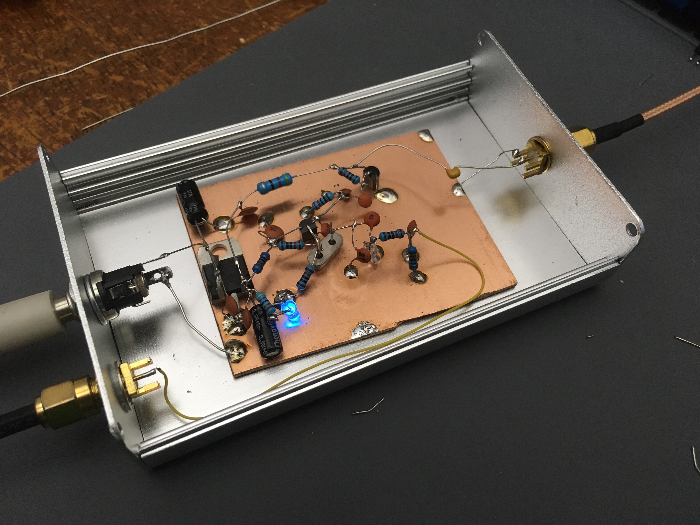
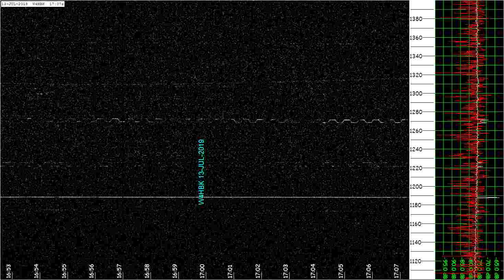
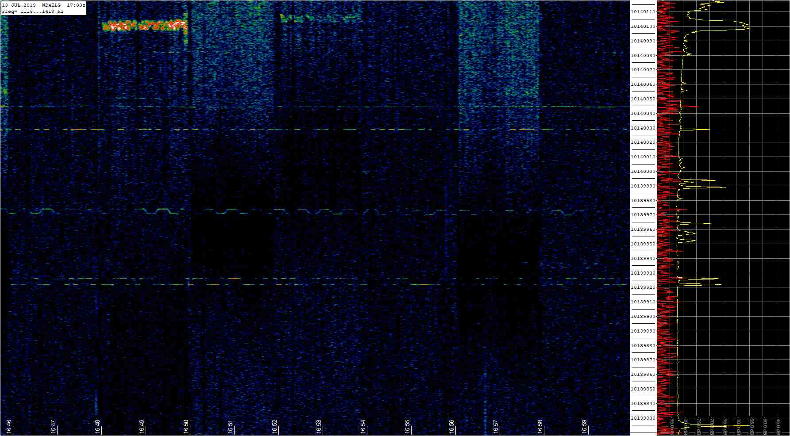
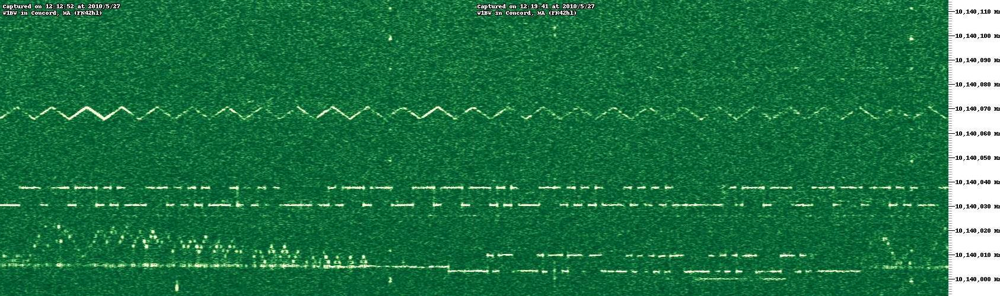

# AJ4VD QRSS Spots

This page serves is a running log of notable QRSS spots. AJ4VD's QRSS signal is transmitted from Gainesville, Florida, USA.

### 2019-07-13

This week I strung-up a 30m dipole in the attic and built an oscillator, keyer, and amplifier (they're all separate modules because I intend to tinker with them individually). I finished the amplifier this morning and spotted the signal (the rectangular squiggle) on two grabbers.

Description | Image
---|---
oscillator (colpitts / varactor) | 
keyer (ATTiny2313) | 
amplifier (IRF510 class C) | 
spotted in Pensacola, FL (W4HBK) | 
spotted in Greensboro, NC (WD4ELG) | 

# History of AJ4VD and QRSS

**Discovering QRSS (Mar, 2009):** I first noted interest in QRSS on my website in March, 2009 when I cited [a page](https://web.archive.org/web/20100107204201/http://g4oep.atspace.com/qrss/qrss.htm) summarizing the topic. I had no experience in radio at the time. I ordered a VHF radio that month and got a technician radio license in April, 2009. In May I used a can oscillator to generate a 28MHz signal I could pick up with my FM radio scanner a few thousand feet away.

**QRSS Capture (Dec, 2009):** I captured my first QRSS signal in Dec 2009. It was Dave Hassall (WA5DJJ) and I was thrilled because I had seen [his website](http://www.zianet.com/dhassall/) before. I got my callsign (KJ4LDF at the time) added to [his spotters list](http://www.zianet.com/dhassall/QRSSMILES.html).

**Spectrograph software (March, 2010):** Since I had limited antenna space, little knowledge, and no general-class radio license, I channeled my interest in QRSS into learning more about its reception by writing analysis software. I first noted developing a spectrograph in March, 2010 (during dental school spring break). That project later matured into [QRSS-VD](https://github.com/swharden/QRSS-VD).

**First QRSS Spot (May, 2010):** I wish I documented this better! My first QRSS spot used the CKOUT signal of a microcontroller clocked at 10.140MHz to trigger a line driver fed directly into a wire antenna on the ceiling of my apartment. I am guessing this was May 2010. It took no time for me to start using the microcontroller to drive a varactor diode to frequency-shift the signal in annoying ways. The QRSS gator on May 27, 2010 is my first spot (received in in MA, satisfyingly by somebody using QRSS-VD software). While I used my own transmitter design (~100mW) I had a lot of help getting the signal out using UF's amateur radio club station (W4DFU) antenna (an 80m dipole at 120 ft).

**Hiatus (Aug, 2011):** I actively experimented with QRSS almost every day until August, 2011 when a large change in my personal life led me to put the hobby down. As part of a move I boxed-up all my electronics equipment, and I never got around to pulling it out. I broke-out some equipment in 2013 and again in 2015 with the goal of building an ovenized transmitter, but got so distracted with temperature regulation (both times) that I burned out before I ever made anything meaningful.

**QRSS Plus (July, 2013):** Although I didn't keep-up experimenting with QRSS _hardware_ for several years, I quietly followed the QRSS mailing lists. I noticed that a huge amount of posts were people saying, "I just turned on my grabber", or "my grabber is going offline" and I thought it would be useful to make an automatically-updating active QRSS grabber list. I called the project [QRSS Plus](http://swharden.com/qrss/plus/) I first implemented it entirely in PHP in July 2013. I recoded the back-end in Python in 2016, and the front-end is still PHP. I'm proud that QRSS Plus has been continuously running since 2013!

**Will AJ4VD be back? (July, 2019):** During my QRSS hiatus I continued to work on software and hardware projects. Although none of them were in the RF/QRSS world, getting back into this hobby was always been in the back of my mind. Medical issues (chemotherapy / bone marrow transplant) made me stop everything for about 6 months (including a month I lived in the hospital), but after that I found myself being drawn back into the QRSS hobby. I strung-up an attic antenna, a QRSS transmitter, and spotted the signal on July 13. We will see where it goes from here...