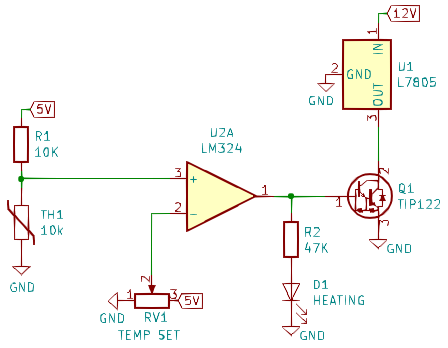

# Lazy Oven

This folder documents my experiments with a chassis heater made from just two TO-220 components.

### QRSS Oscillators Need Ovens
My oscillator looks stable on time scales of minutes, but on time scales of hours it is obvious that it wobbles as my central air conditioning turns on and off. I could go nuts with Styrofoam, but a crystal oven (or chassis heater) is warranted.

### Why I want a chassis heater (not a oven heater)
Some DIY QRSS ovens use resistors as the heater element and package the heater and temperature sensor against the crystal. While temperature stability of the crystal is good, I prefer to thermo-stabilize all frequency-determining components (capacitors and varactors) of the oscillator circuit. For this reason, I prefer a chassis heater.

### Lazy Chassis Heater Design
My design is out of spec and not recommended... but it seems to work! It uses a shorted-to-ground voltage regulator as the primary heating element.

#### Pros
* parts are easy to mount onto a metal chassis
  * [LM7805](https://www.mouser.com/ProductDetail/Texas-Instruments/LM7805CT-NOPB?qs=sGAEpiMZZMtUqDgmOWBjgBeg5pzg%2F1aQ1zF1gFoZCvY%3D) is TO-220 ($1.53)
  * [TIP122](https://www.mouser.com/ProductDetail/STMicroelectronics/TIP122?qs=sGAEpiMZZMutXGli8Ay4kAuOt55Alb1HlrwjuqhEgeo%3D) is TO-220 ($0.63)
* the heater elements are common parts
  * chassis mount power resistors are less common than voltage regulators
  * shunt resistors are small value, get hot, and can be hard to mount

#### Cons
* bang-bang regulation (though this could be improved)
* LM7805 is over-driven
  * The regulator gets essentially shorted to ground
  * The chip can't supply that, so its current limiter kicks in
  * During this time, the regulator acts as a heater

### What about a PCB heater?
An experiment I would like to try is to use resistors as heater elements on an all-SMD board. Rather than heating the whole chassis, I could heat the PCB. This would naturally control temperature of the crystal and all oscillator components.