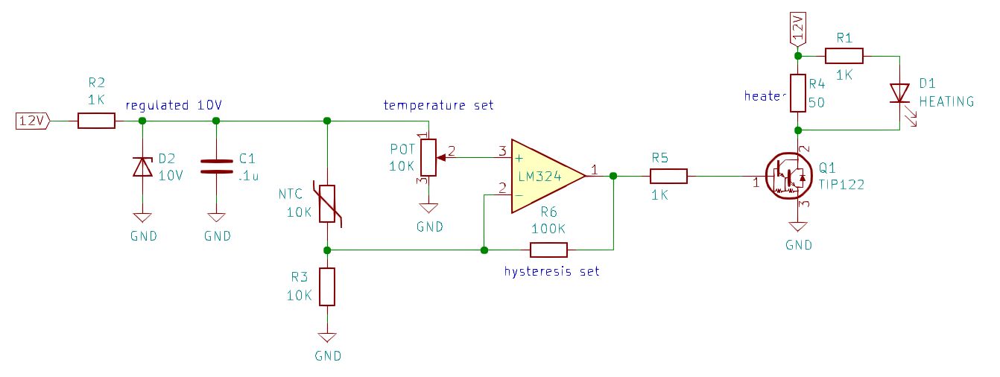

# Chassis Heater / Crystal Oven

This folder documents my thoughts and experiments related to development of a chassis heater. Since I'll build the chassis heater inside an insulated container, I'll refer to it as a chassis oven.

Previously I experimented with a [lazy oven design](../2019-07-14%20lazy%20oven) that used a shorted-to-ground voltage regulator as the primary heating element, but this design will be a bit more traditional.

**Why I want a chassis heater (not a crystal heater):**
Some DIY QRSS ovens use resistors as the heater element and package the heater and temperature sensor against the crystal. While temperature stability of the crystal is good, I prefer to thermo-stabilize all frequency-determining components (capacitors and varactors) of the oscillator circuit. For this reason, I prefer a chassis heater.

## Component selection

After running the numbers for a bunch of different power/resistor combinations, I decided to work with 50-Ohm power resistors. I'd love to have more 50-Ohm power resistors on hand to use for making dummy loads.

I settled on this part: [50 Ohm (+/- 1%) 12.5 watt resistor](https://www.mouser.com/ProductDetail/Vishay-Dale/RH01050R00FE02?qs=sGAEpiMZZMtbXrIkmrvidDNaDpN5VXc5nhpgDg1t8QQ%3D) ($2.64)

Running 12V through a single resistor would burn 2.88W of power as heat. If we wanted more heat we could add additional resistors in parallel, but this should be okay.

## Chassis Heater Circuit
After the above considerations, this is what I came up with. I made it on a breadboard and it works well.

* You can supply it with dirty power
* Consider using a multi-turn potentiometer for RV1
* R6 sets hysteresis
  * Large values promote squishy temperature control. 
  * Small values will faster responses but may oscillate
  * Remove R6 for bang-bang operation
* This design could be used as a crystal oven
  * Replace Q1 with a 2N2222 (but the TIP122 works too)
  * Replace R4 with a 680 Ohm 1/4-watt resistor (~17 mA, ~200 mW)

## Chassis Heater: Lazy Version
**This is a bad idea and you probably shouldn't build this... but I'm going to build it just to see what happens!** The idea sounds crazy: use a voltage regulator shorted to ground as a heating element. It just might work because the LM7805 has current limiting and thermal shutdown built-in, and once temperature stabilizes the Darlington transistor becomes the primary heating element.

* Only two components are required for the heater
  * Both are TO-220 and easy to mount to a metal chassis
  * Both are probably already in your junk box
* During warm-up the voltage regulator will be shorted to ground. 
  * Yes, this is probably bad.
  * ...but the L7805 has a current limiter built in!
  * during warm-up, the voltage regulator is the primary heating element
  * ...but the L7805 has thermal shutdown built in!
* Once stabilized, the transistor is the primary heating element