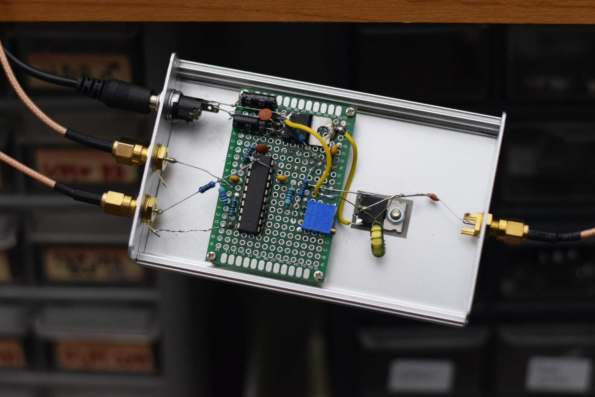
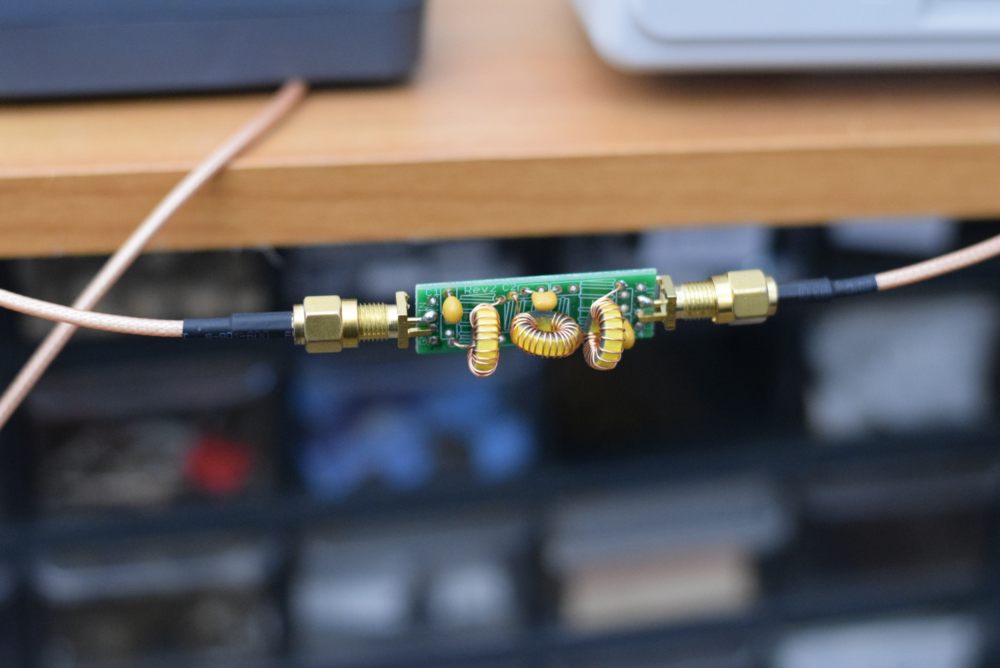

# QRSS Amplifier

I built a crude amplifier just to get on the air. It outputs about 1W and uses an IRF510 final stage (class C). It also accepts an on-off-keying (OOK) signal (amplifier output is disabled when this line is high).

If the output inductor were wound as a transformer, this circuit could handle much more power output.

### Class C Notes

* Inductor values for 50 Ohms impedance at 10.14 MHz
  * 13 turns on a T50-2 is 0.83 uH (52.8 Ohms)
  * 16 turns on a T37-6 is 0.77 uH (48.9 Ohms)
* A SMT [82 uH (300 mA) inductor](https://www.mouser.com/ProductDetail/Wurth-Elektronik/7447669182?qs=sGAEpiMZZMsg%252By3WlYCkU9du5C09XLa6DQHwJKVZZ3I%3D) 4532 ($0.39) could be nice
* ~~[IRF510](https://www.mouser.com/ProductDetail/Vishay-Siliconix/IRF510SPBF?qs=sGAEpiMZZMshyDBzk1%2FWi1F3z9PgzPBnwTk%2FKoweXds%3D) TO-263-3 ($1.23)~~
  * Use smaller transistors/FETs for finals. 
  * IRF510 has high gate capacitance and is has more power than QRSS needs.

### Lowpass filter

#### Quick and dirty 3-pole

According to the [Chebyshev Calculator](http://www.calculatoredge.com/electronics/ch%20pi%20low%20pass.htm): 

* C1 and C2 = 200 pF
* L1 = 761 nH (16t on T37-6)

#### QRP Labs 5-pole
I had one of [these](https://www.qrp-labs.com/images/lpfkit/assembly_A4.pdf) around so I made an in-line filter module for 30m.

* L2 = 20t on T37-6 (1.26 uH)
* L1 and L3 = 19t on T37-6 (1.09 uH)
* C1 and C4 = 270
* C2 and C3 = 560

