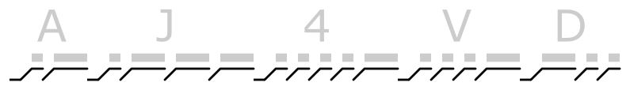

# QRSS Keyer

I'd like to use an interesting pattern that takes advantage of FSK and OOK. I want it to be 5 Hz or less in bandwidth, and I want it to be recognizable but not boring. I'm leaning toward something like:

### Design

An ATTiny2313 is used for the keyer (the code is [main.c](main.c)).

View the varactor notes of the oscillator section for FSK details.