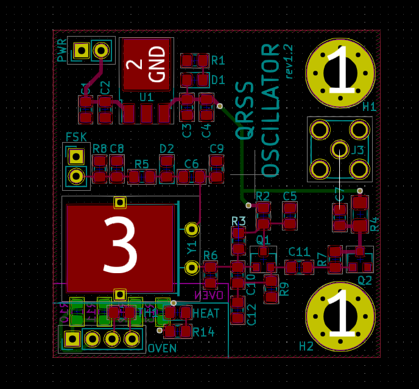

# QRSS Oscillator

This page documents development of a voltage-controlled oscillator suitable for QRSS. The oscillator project is developed in concert with the oven project.

## Varactor FSK Designs for QRSS

For QRSS it's convenient to have 2 frequency shift adjustments: a coarse one to set frequency (~200 Hz), and a fine one for FSK (5 Hz). 

Most QRSS TX designs use a variable capacitor to set the coarse adjustment, but I don't like that design because it means you have to open your enclosure every time you want to shift frequency:

VK2ZAY shows a design that pulls one leg of a crystal using two varactors, the magnitude of each is controlled by a series capacitor:

I tried building designs like this I find them very frustrating. 

Issue 1: coarse adjustment modifies FSK shift.
Every time I adjust the coarse voltage, the FSK distance changes. Consider a coarse adjustment resulting in a small capacitance: the fine FSK can produce a large shift. When the coarse produces a large capacitance, the fine FSK has little effect. If your fine FSK is a perfect 5Hz and you adjust the coarse frequency, your FSK is no longer 5Hz.

Issue 2: ~varactor diodes are too variable at low voltages. For stable operation it helps to run a varactor at several volts. I fix this by running the FSK voltage through a voltage divider _to VCC_ (not ground), and use the high-pulled fractional voltage on the varactor.~ Actually this was only a problem for reverse-biased LEDs. Real varactor diodes worked fine at low voltages.

***NOTE TO SELF: Use a real varicap diode! You have [BB132](https://uk.rs-online.com/webdocs/0466/0900766b80466490.pdf) (around 60 pF) and [BB149A](http://pdf.datasheetcatalog.com/datasheet/NXP_Semiconductors/BB149A.pdf) (around 20 pF) so you can get tons of swing by using one! Stop using reverse-biased LEDs!*** A reverse-biasd blue LED measured 60 Hz swing (with a lot of additional fixed capacitance in place to get near center frequency). Replacing this with a BB132 (I had to remove a 5pA cap to compensate) I got a swing of 159 Hz. That's more than double, and that's just one varicap. You can stack them in parallel. **Real varicaps dont mind low voltage*** I found out, so don't worry about avoiding that super low region like with the LED.

This is a design I came up with that seems to be treating me well so far. Fixed capacitors (optionally populated) set the frequency so the crystal oscillates in the QRSS band. The coarse adjustment moves the signal around the QRSS band (100Hz). The fine adjustment is pulled high through a divider. Adjust R4 to control how wide the FSK can be.

## QRSS Oscillator Revision 1.1

### Design

### Build Notes

* I used BB132 for the varicap
* I used 33P for C6
* For C9 I used 33p (should be NP0)
* For C11 I used 100p
* For C10 and C12 I used NP0 120p caps

## QRSS Oscillator Revision 1.2

This version has the oven built into the PCB.
The oven controller is still external.
Not sure how many resistors need to actually be populated for the oven.

### Design

