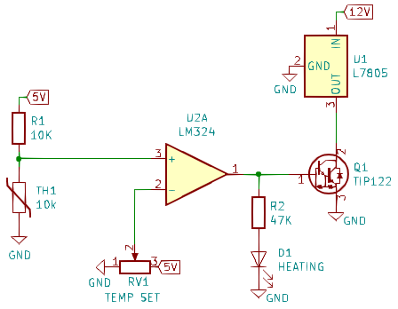
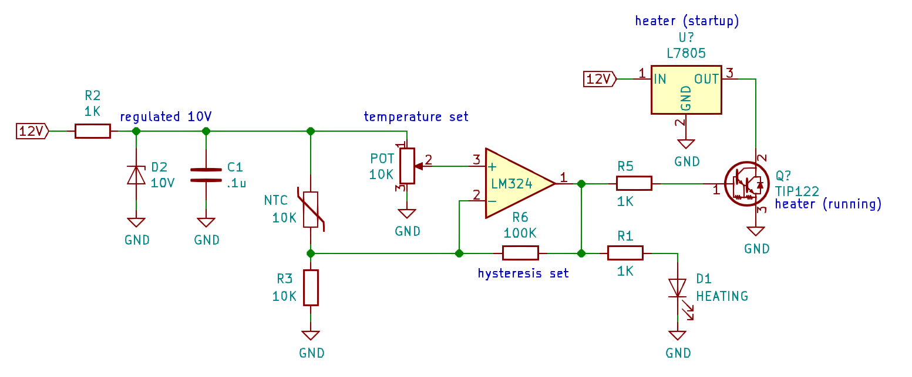

# Lazy Oven

This folder documents my experiments with a chassis heater made from just two TO-220 components. This is crazy! Don't do this. I built this just to see what would happen.

My design is out of spec and not recommended... but it seems to work! It uses a shorted-to-ground voltage regulator as the primary heating element.

#### Pros
* parts are easy to mount onto a metal chassis
  * [LM7805](https://www.mouser.com/ProductDetail/Texas-Instruments/LM7805CT-NOPB?qs=sGAEpiMZZMtUqDgmOWBjgBeg5pzg%2F1aQ1zF1gFoZCvY%3D) is TO-220 ($1.53)
  * [TIP122](https://www.mouser.com/ProductDetail/STMicroelectronics/TIP122?qs=sGAEpiMZZMutXGli8Ay4kAuOt55Alb1HlrwjuqhEgeo%3D) is TO-220 ($0.63)
* the heater elements are common parts
  * chassis mount power resistors are less common than voltage regulators
  * shunt resistors are small value, get hot, and can be hard to mount

#### Cons
* bang-bang regulation (though this could be improved)
* LM7805 is over-driven
  * The regulator gets essentially shorted to ground
  * The chip can't supply that, so its current limiter kicks in
  * During this time, the regulator acts as a heater

  
# Lazy Oven V2

**This is a bad idea and you probably shouldn't build this... but I'm going to build it just to see what happens!** The idea sounds crazy: use a voltage regulator shorted to ground as a heating element. It just might work because the LM7805 has current limiting and thermal shutdown built-in, and once temperature stabilizes the Darlington transistor becomes the primary heating element.

***Update: I built this and it seemed to actually work. As expected the regulator did most of the heating. I'm not going to pursue this as a final design because I don't know long long the regulator can be stressed like that before failing.***

* Only two components are required for the heater
  * Both are TO-220 and easy to mount to a metal chassis
  * Both are probably already in your junk box
* During warm-up the voltage regulator will be shorted to ground. 
  * Yes, this is probably bad.
  * ...but the L7805 has a current limiter built in!
  * during warm-up, the voltage regulator is the primary heating element
  * ...but the L7805 has thermal shutdown built in!
* Once stabilized, the transistor is the primary heating element