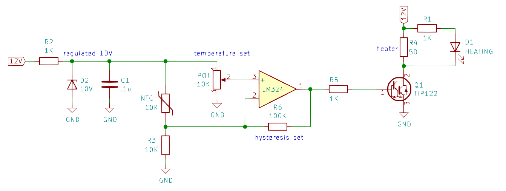

# Chassis Heater / Crystal Oven

This folder documents my thoughts and experiments related to development of a chassis heater. Since I'll build the chassis heater inside an insulated container, I'll refer to it as a chassis oven.

### Design

After running the numbers for a bunch of different power/resistor combinations, I decided to work with 50-Ohm power resistors. I'd love to have more 50-Ohm power resistors on hand to use for making dummy loads.

I settled on this part: [50 Ohm (+/- 1%) 12.5 watt resistor](https://www.mouser.com/ProductDetail/Vishay-Dale/RH01050R00FE02?qs=sGAEpiMZZMtbXrIkmrvidDNaDpN5VXc5nhpgDg1t8QQ%3D) ($2.64)

Running 12V through a single resistor would burn 2.88W of power as heat. If we wanted more heat we could add additional resistors in parallel, but this should be okay.

### Circuit
After the above considerations, this is what I came up with. I made it on a breadboard and it works well.

* You can add multiple R4s in parallel for faster heating
* I ended-up replacing the TIP122 (Darlington transistor) with an IRF510 (N-channel MOSEFET) for better linear operation (since the TIP122 has such high gain)
* You can supply it with dirty power and it doesn't seem to affect oscillator performance
* I use a multi-turn potentiometer for RV1
* R6 sets hysteresis
  * Large values promote squishy temperature control. 
  * Small values will faster responses but may oscillate
  * Remove R6 for bang-bang operation
* I suspect this design could be used as a _crystal_ oven
  * Replace Q1 with a 2N2222
  * Replace R4 with a 680 Ohm 1/4-watt resistor (~17 mA, ~200 mW)
