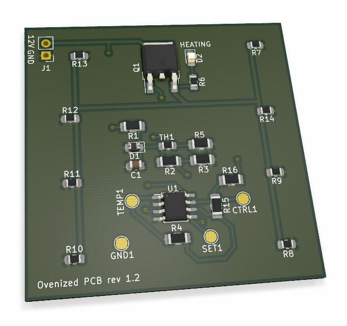
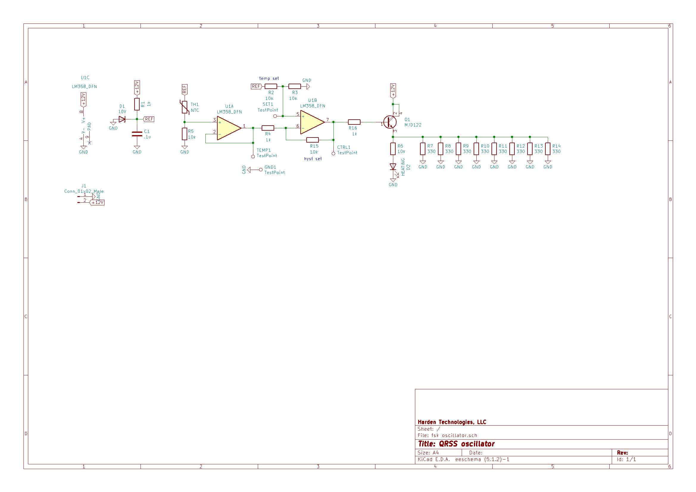

# PCB Heater r1.2

The ultimate goal is to create a thermo-stable oscillator by heating the PCB to above ambient temperature (about 120F). This board tests how effective 8x 330 Ohm resistors can be at heating a 5cm x 5cm PCB. 

* A 10K NTC thermistor senses temperature in the center of the board
* At 12V each 330 Ohm resistor passes 36.3 mA (437 mW)
* Total max heating power is around 3.5 W
* The transistor also serves as a heating element

## Build Notes

_I ordered this board on 2019-09-01_